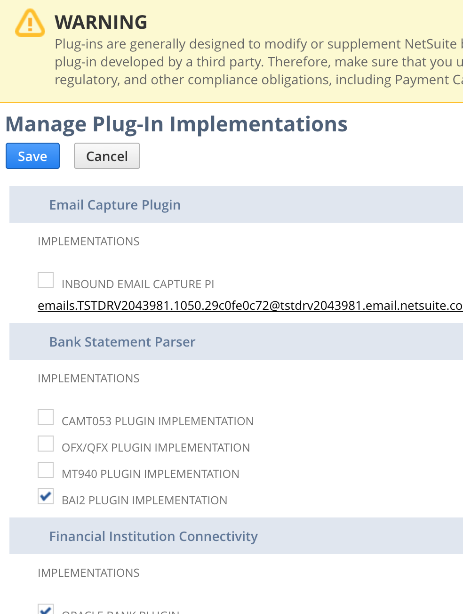
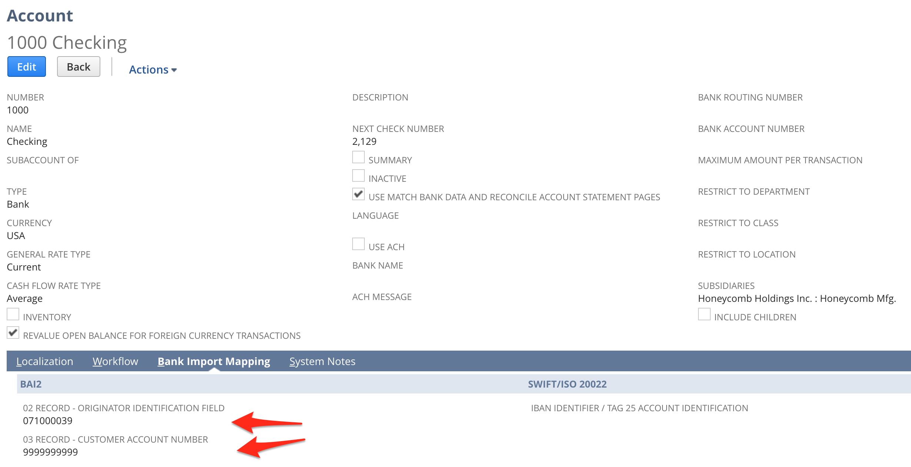
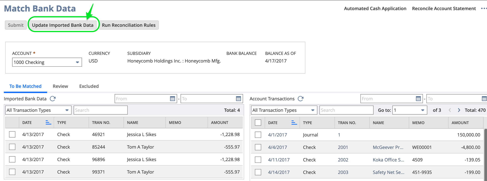
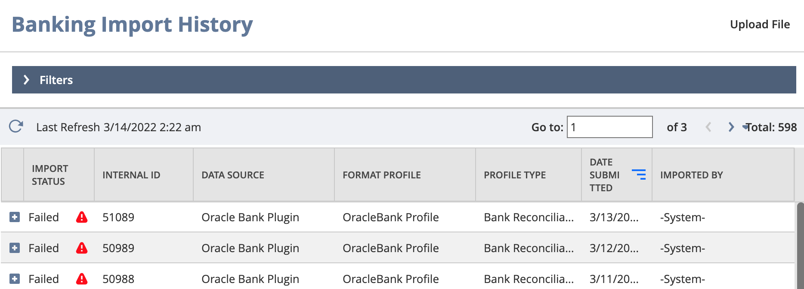

# Setup
#### Customization > Plug-ins > Manage Plug-ins
- Enable plugin

Setup > Accounting > Chats of Accounts

#### Setup > Accounting > Finantial Institution > List

# Menues
#### Transactions > Bank > Match Bank Data
- Get transactions manualy

#### Transaction > Banks > Bank Import History

# Develop
Customization > Plugins > Plugin implementations
- View > Excecution Log
